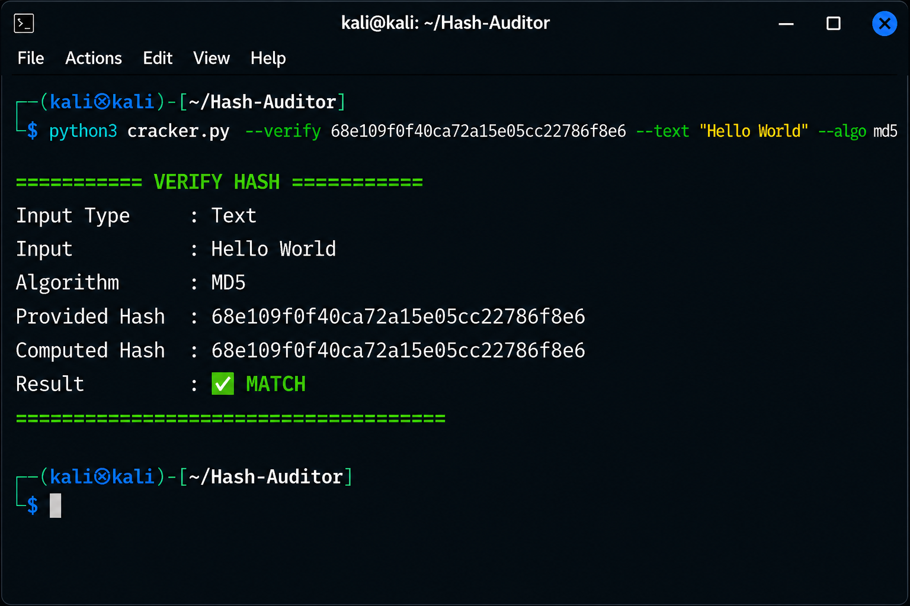
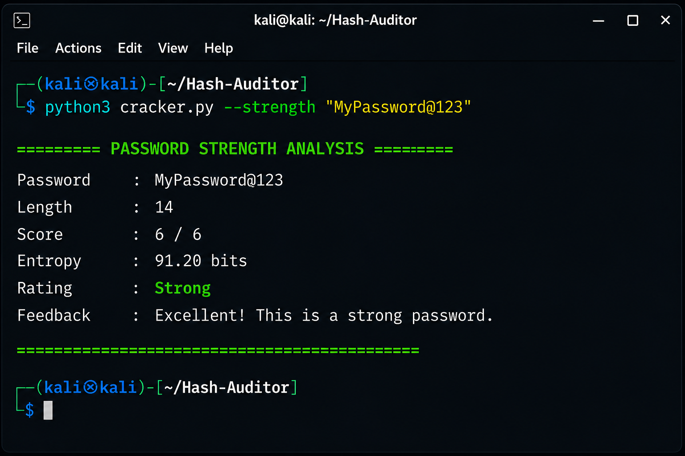
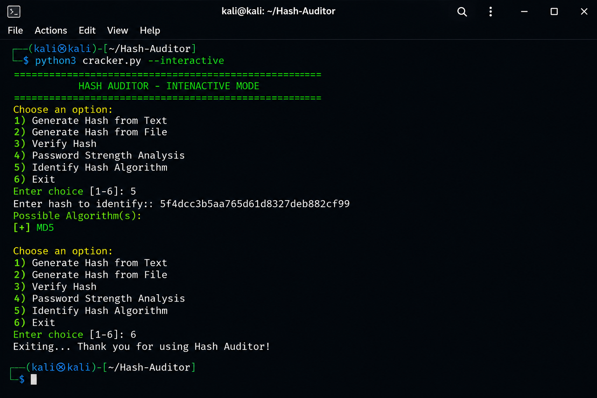
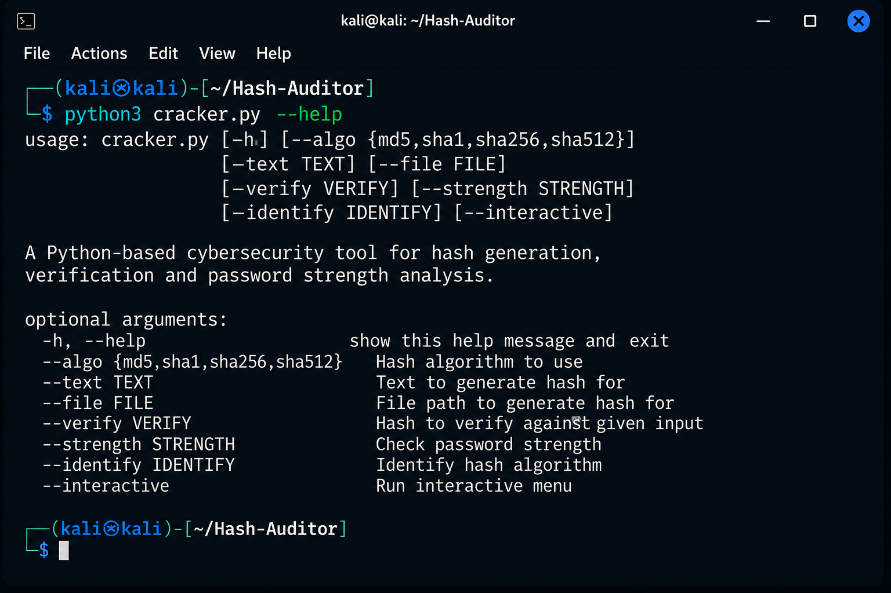

# 🔐 Hash Auditor

A Python-based cybersecurity tool for generating, verifying, and analyzing cryptographic hashes.

## ✨ Features

- Generate MD5 hashes
- Generate SHA1 hashes
- Generate SHA256 hashes
- Generate SHA512 hashes
- Verify text hash
- Verify file hash
- Password strength analysis
- Interactive menu mode
- Command-line support

## 📦 Requirements

- Python 3.x

No external libraries are required.

## 🚀 Installation

```bash
git clone https://github.com/AyushSharma-arch/Hash-Auditor.git
cd Hash-Auditor
```

## ▶️ Usage

### Interactive Mode

```bash
python3 cracker.py --interactive
```

### Generate Text Hash

```bash
python3 cracker.py --text "hello" --algo sha256
```

### Generate File Hash

```bash
python3 cracker.py --file test.txt --algo sha256
```

### Verify Text Hash

```bash
python3 cracker.py --text "hello" --verify HASH --algo sha256
```

### Verify File Hash

```bash
python3 cracker.py --file test.txt --verify HASH --algo sha256
```

### Password Strength Check

```bash
python3 cracker.py --strength "MyPassword123!"
```

## 🛠 Technologies Used

- Python
- hashlib
- argparse
- hmac
- pathlib
- regex

## 📁 Project Structure

```
Hash-Auditor/
│
├── cracker.py
├── README.md
├── LICENSE
├── requirements.txt
└── screenshots/
```

## 👨‍💻 Author

Ayush Sharma

GitHub:
https://github.com/AyushSharma-arch

## Screenshots

### Generate Text Hash


### Generate File Hash


### Verify Text Hash


### Password Strength Analysis


### Interactive Mode


### Help Menu


---

⭐ If you like this project, consider giving it a Star.
